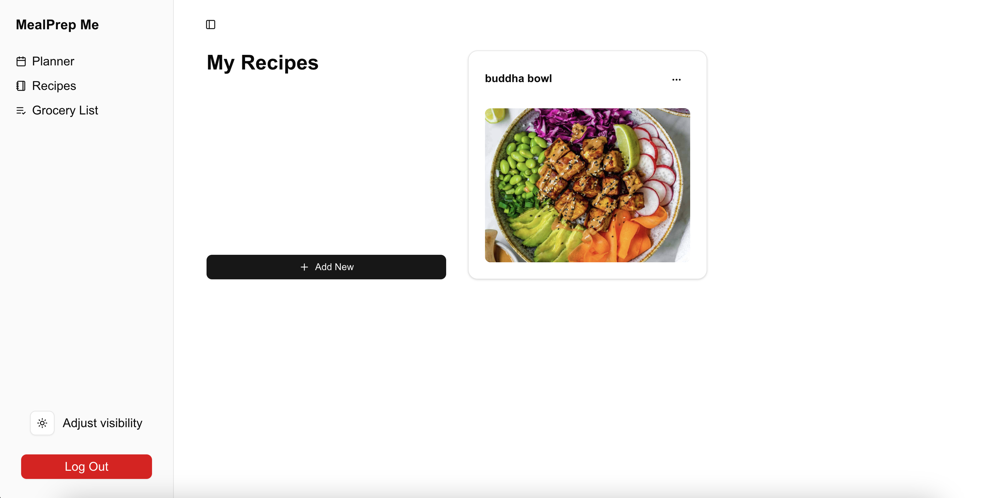
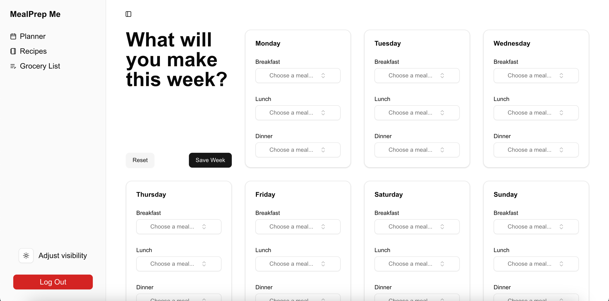
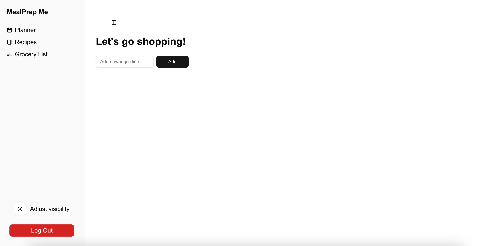

# MealPrep Me

> Developed by Caroline Bryan and Katie Brown for COMP 426: Modern Web Programming at UNC-Chapel Hill.

Meet MealPrep Me! This website helps users in planning out their weekly meals, simplifying recipe storage, grocery planning, and nutrition goals.

## Current Features

### Feature 1: Recipe Cards
Users can create, delete, and view recipes. Recipes include a title, a list of ingredients, and optional photos, descriptions, or links.

### Feature 2: Meal Planning
Plan each day's meals ahead of time and link to relevant saved recipes!

### Feature 3: Grocery List
Users can add, remove, and check off items on their grocery lists.

These features were implemented using: Shadcn elements, React / React Query, and Supabase (Realtime).
