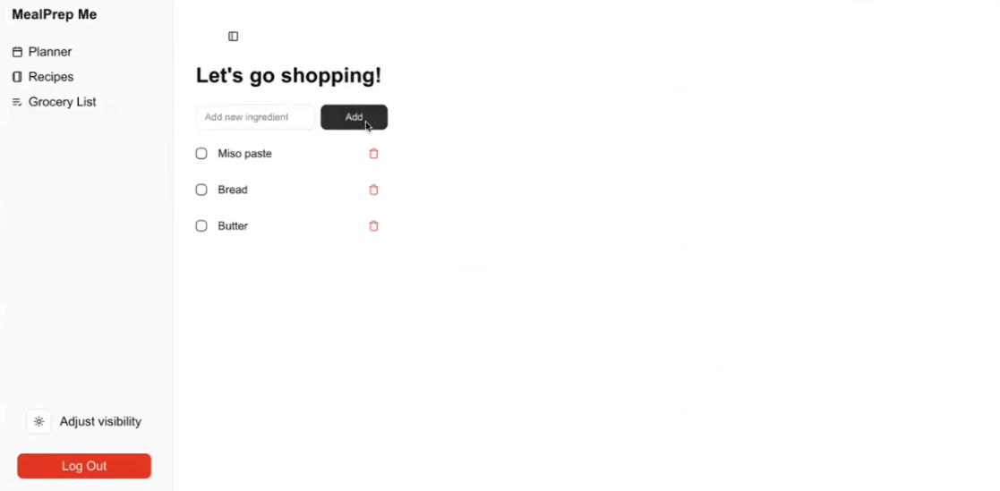

# MealPrep Me

> Developed by Caroline Bryan and Katie Brown for COMP 426: Modern Web Programming at UNC-Chapel Hill.

Meet MealPrep Me! A web app dedicated to helping users simplify meal planning and grocery shopping.

## Current Features

### Recipe Cards

Users can create, delete, and view their saved recipes. Recipes include a title, a list of ingredients, and optional photos, description, instructions or links.

### Meal Planning

Plan each day's meals ahead of time by selecting your meal from the dropdown menu! Save your week each time you make any changes, or reset it completely for a fresh start.

### Grocery List

Users can add, remove, and check off items on their grocery lists.

## Built Using

